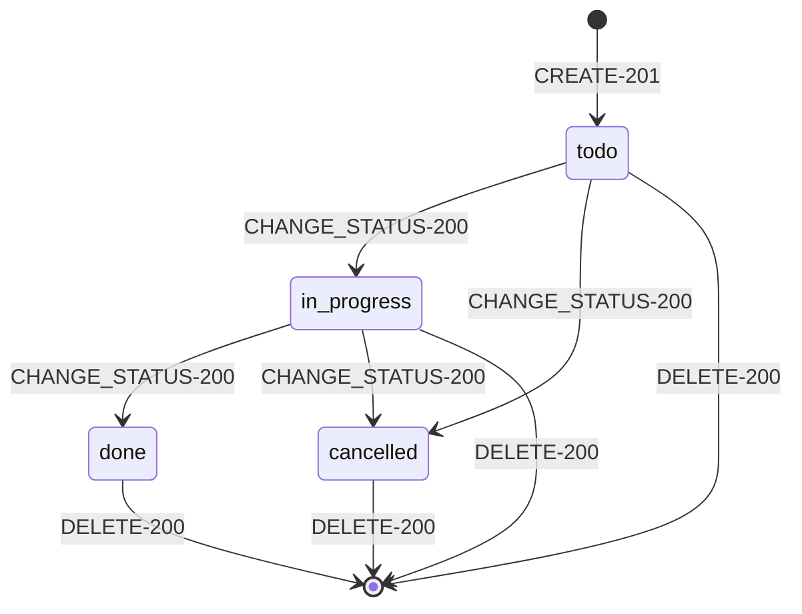

# Спецификация модуля «Задачи» (`TASKS`)
## Соглашения по неймингу (Actors · Entities · States · Events · Use Cases)

Документ фиксирует правила именования модуля `TASKS` (таск-трекер: создание,
назначение, смена статуса и удаление задач, плюс выпуск MCP-токенов для
подключения агентов) в нотации `RA-...-НА-...-<HTTP>`, по образцу
`inventorynamingspec.md`, при помощи скилла `spec-builder-ra`.

Модуль не регулируется внешними отраслевыми стандартами (в отличие от
`INVENTORY` с ветеринарной сферой) — Фаза 3/5 («Сверка со стандартами»)
пропущена осознанно, а не по недосмотру.

---

## Формула нейминга (кратко)

| Тип | Формат | Регистр | Пример |
|-----|--------|---------|--------|
| **Актор** | `RA-<МОДУЛЬ>-ACTOR-<ИМЯ>` | код: `UPPER_SNAKE`, англ. | `RA-TASKS-ACTOR-USER` |
| **Сущность** | код `RA-<МОДУЛЬ>-ENTITY-<ИМЯ>` + отображаемое имя | код: `UPPER_SNAKE`; имя: `PascalCase`, ед. число | `RA-TASKS-ENTITY-TASK` → `Task` |
| **Ивент (доменное событие)** | `RA-<МОДУЛЬ>-EVENT-<ГЛАГОЛ>` | `UPPER_SNAKE`, глагол-команда | `RA-TASKS-EVENT-ASSIGN` |
| **Стейт** | статус-константа | `lower_snake_case` | `todo`, `in_progress`, `done`, `cancelled` |
| **Use case** | `RA-<МОДУЛЬ>-<АКТОР>-<ДЕЙСТВИЕ>-НА-<ENTITY>-<HTTP-КОД>` | `UPPER_SNAKE` + литеральная вставка `-НА-` | `RA-TASKS-USER-CREATE-НА-TASK-201` |

**Принцип различимости:** как и в `INVENTORY`, тип-маркер (`ACTOR` / `ENTITY` /
`EVENT`, либо `-НА-<ENTITY>-<HTTP>`) зашит прямо в код, поэтому уровень
адресации виден без контекста.

> **Отличие от `INVENTORY`:** глагол `<ДЕЙСТВИЕ>` в `TASKS` тоже переиспользуется
> и как имя доменного события (`RA-TASKS-EVENT-ASSIGN`), и как сегмент кода
> use case (`RA-TASKS-USER-ASSIGN-НА-TASK-200`) — тот же осознанный
> компромисс, что и в `INVENTORY`. Отдельная особенность `TASKS`: часть
> акторов работает не через REST (реальные HTTP-коды `200/201/401/403/404/422`),
> а через MCP JSON-RPC — там транспортный HTTP-код почти всегда `200`
> (или `401` при невалидном MCP-токене), а фактический исход кодируется
> внутри тела JSON-RPC (`result` vs `error`). Это зафиксировано отдельно в
> разделе «MCP-транспорт» ниже, а не подменяет собой HTTP-коды REST-версии
> тех же use case.

---

## Общие принципы

1. **Единый язык.** `Task` — задача, `McpToken` — отзываемый токен доступа
   MCP-агента к API модуля. Не смешивать с `access_token` Sanctum (это
   токен модуля `AUTH`, вне области `TASKS`).
2. **Глобальный префикс модуля** `RA-TASKS-` — как в `INVENTORY`, для
   однозначности кодов вне модуля.
3. **Единственное число** для сущностей: `Task`, `McpToken`.
4. **Use case — не то же самое, что ивент** (см. врезку выше).
5. **Атомарность use case.** Один use case = один исход.
6. **500-е не описываются.**
7. **Стейты — нижний регистр**, доменные слова: `todo`, `in_progress`,
   `done`, `cancelled`, `active`, `revoked`.
8. **Без сокращений без расшифровки**, кроме зафиксированных ролевых
   аббревиатур акторов, расшифрованных в таблице акторов.
9. **Аутентификация — вне модуля.** Регистрация/логин (Sanctum) относятся к
   модулю `AUTH`, не к `TASKS`: все use case `TASKS` предполагают уже
   аутентифицированного актора (аналогично тому, как `INVENTORY`
   предполагает уже аутентифицированного `VET`).

---

## 1. Акторы

**Правило:** `RA-TASKS-ACTOR-<ИМЯ>`, англ., `UPPER_SNAKE`.

| Код | Актор | Роль |
|---|---|---|
| `RA-TASKS-ACTOR-USER` | Пользователь | Аутентифицирован через Sanctum (`access_token`); создаёт задачи, читает/меняет любую задачу, управляет своими MCP-токенами |
| `RA-TASKS-ACTOR-ASSIGNEE` | Исполнитель | Пользователь (тот же тип учётной записи, что `USER`), назначенный на конкретную задачу через `assignee_id` — используется, когда важно подчеркнуть роль получателя, а не автора действия |
| `RA-TASKS-ACTOR-MCP_CLIENT` | MCP-агент | Внешний клиент (Claude Code, другой MCP-совместимый агент), авторизован отдельным `McpToken` (не Sanctum-токеном); действует от имени владельца токена |
| `RA-TASKS-ACTOR-GUEST` | Гость | Не аутентифицирован; может обращаться только к `RA-TASKS-*-НА-TASK-401` guard-исходам (доступ отклонён) |

> Отличие от `INVENTORY`: в `TASKS` нет неантропоморфных акторов-предусловий
> (аналог `TASK` в `INVENTORY`) и системных каскадных акторов (`SYSTEM`) —
> в текущей реализации модуля нет фоновых/асинхронных мутаций задач.
> Если такие появятся (например, автозакрытие просроченных задач), для
> этого потребуется завести `RA-TASKS-ACTOR-SYSTEM` по аналогии.

---

## 2. Сущности

**Правило:** код `RA-TASKS-ENTITY-<ИМЯ>` (`UPPER_SNAKE`), отображаемое имя —
`PascalCase`, ед. число.

| Код | Сущность | Назначение | Ключевые поля | Связи |
|---|---|---|---|---|
| `RA-TASKS-ENTITY-TASK` | `Task` | Корень модуля — единица работы | `id` (uuid), `title`, `description`, `status`, `assignee_id`, `created_by_id` | belongs-to `User` (как `assignee` и как `creator`) |
| `RA-TASKS-ENTITY-MCP_TOKEN` | `McpToken` | Отзываемый токен доступа MCP-агента | `id` (uuid), `user_id`, `token`, `name`, `revoked_at` | belongs-to `User` |

`User` — внешняя по отношению к модулю сущность (принадлежит `AUTH`),
в `TASKS` используется только по ссылке (`assignee_id`, `created_by_id`,
`user_id` в `McpToken`).

**Наблюдение:** в отличие от `INVENTORY`, где дочерние сущности
префиксуются именем корня (`InventoryAnimal`, `InventoryDrug`), в `TASKS`
всего одна дочерняя сущность модуля (`McpToken`), и она не является частью
жизненного цикла `Task` — это независимая сущность с собственным жизненным
циклом, размещённая в модуле по функциональной близости (авторизация
доступа к API `TASKS`), а не по составу агрегата.

---

## 3. Стейты сущностей

**Правило:** `lower_snake_case`.

### `Task`
```
todo → in_progress → done
todo / in_progress → cancelled
done, cancelled — терминальные
```

| Стейт | Значение |
|---|---|
| `todo` | Не начата (стейт по умолчанию при создании) |
| `in_progress` | В работе |
| `done` | Выполнена (терминальный) |
| `cancelled` | Отменена (терминальный) |

> В отличие от `Inventory` в `INVENTORY`, у `Task` нет отдельного черновика
> (`draft`) — задача сразу создаётся в `todo` и сразу видна/редактируема.

### `McpToken`
```
active → revoked
```
| Стейт | Значение |
|---|---|
| `active` | Токен действителен, принимается middleware `AuthenticateMcpToken` |
| `revoked` | Токен отозван (терминальный; восстановление не предусмотрено — нужно выпускать новый) |

> Отличие от `InventoryAnimal` (`active ⇄ detached`, обратимо): у `McpToken`
> переход **односторонний** — в текущей реализации нет use case
> «восстановить токен», что осознанно (отозванный токен считается
> скомпрометированным/устаревшим).

---

## 4. Ивенты (доменные события)

**Правило:** `RA-TASKS-EVENT-<ГЛАГОЛ>`, `UPPER_SNAKE`, глагол-команда.

| Код | Что происходит | Переход |
|---|---|---|
| `RA-TASKS-EVENT-CREATE` | Создание задачи | `Task`: `∅ → todo` |
| `RA-TASKS-EVENT-CHANGE_STATUS` | Смена статуса | `Task`: `todo/in_progress → in_progress/done/cancelled` (см. таблицу переходов) |
| `RA-TASKS-EVENT-ASSIGN` | Назначение/переназначение исполнителя | `Task.assignee_id` меняется; стейт `Task` не меняется |
| `RA-TASKS-EVENT-UPDATE_DETAILS` | Правка `title`/`description` | стейт `Task` не меняется |
| `RA-TASKS-EVENT-DELETE` | Удаление задачи (жёсткое, без soft-delete) | `Task`: `* → ∅` |
| `RA-TASKS-EVENT-ISSUE_TOKEN` | Выпуск MCP-токена | `McpToken`: `∅ → active` |
| `RA-TASKS-EVENT-REVOKE_TOKEN` | Отзыв MCP-токена | `McpToken`: `active → revoked` |

> Отличие от `INVENTORY`: удаление `Task` — **настоящее жёсткое удаление**
> (`DELETE FROM tasks`), не soft-delete, как `InventoryAnimal.detached`.
> Если модулю потребуется история/восстановление удалённых задач — это
> смена модели (добавление `deleted_at` + переход `DELETE` из терминального
> в обратимый), а не просто переименование.

---

## 5. Use case: грамматика и HTTP-исходы

**Код:** `RA-TASKS-<АКТОР>-<ДЕЙСТВИЕ>-НА-<ENTITY>-<HTTP-КОД>`

| Код | Значение | Типичное применение в модуле |
|---|---|---|
| `200` | OK | чтение, переход стейта существующей записи, отзыв токена |
| `201` | Created | создание `Task` или `McpToken` |
| `401` | Unauthorized | отсутствует/невалиден `access_token` (Sanctum) или `McpToken` |
| `404` | Not Found | задача/токен не найдены (в т.ч. токен принадлежит другому пользователю — тот же код, без утечки факта существования чужой записи) |
| `422` | Unprocessable | нарушено доменное правило (валидация `title`/`status`/`assignee_id`) |

`449` (`NeedAcceptActions`, как в `INVENTORY`) в модуле **не используется** —
в `TASKS` нет двухфазных «опасных» мутаций с подтверждением; все use case
однофазные.

### REST-версия (актор `USER`)

| Код | Актор | Действие | Предусловие | Результат | Ответ |
|---|---|---|---|---|---|
| `RA-TASKS-USER-CREATE-НА-TASK-201` | Пользователь | CREATE | `title` заполнен, аутентифицирован | `Task` создана, `todo` | 201 |
| `RA-TASKS-USER-CREATE-НА-TASK-401` | Пользователь | CREATE | нет/невалиден `access_token` | — | 401 |
| `RA-TASKS-USER-CREATE-НА-TASK-422` | Пользователь | CREATE | `title` пуст/`assignee_id` не существует | — | 422 |
| `RA-TASKS-USER-LIST-НА-TASK-200` | Пользователь | LIST | — | список задач (опц. фильтр по `status`) | 200 |
| `RA-TASKS-USER-VIEW-НА-TASK-200` | Пользователь | VIEW | задача существует | карточка задачи | 200 |
| `RA-TASKS-USER-VIEW-НА-TASK-404` | Пользователь | VIEW | задача не найдена | — | 404 |
| `RA-TASKS-USER-CHANGE_STATUS-НА-TASK-200` | Пользователь | CHANGE_STATUS | новый статус — валидное значение enum | `Task.status` изменён | 200 |
| `RA-TASKS-USER-CHANGE_STATUS-НА-TASK-404` | Пользователь | CHANGE_STATUS | задача не найдена | — | 404 |
| `RA-TASKS-USER-CHANGE_STATUS-НА-TASK-422` | Пользователь | CHANGE_STATUS | статус вне `todo\|in_progress\|done\|cancelled` | — | 422 |
| `RA-TASKS-USER-ASSIGN-НА-TASK-200` | Пользователь | ASSIGN | `assignee_id` существует или `null` | `Task.assignee_id` изменён | 200 |
| `RA-TASKS-USER-ASSIGN-НА-TASK-422` | Пользователь | ASSIGN | `assignee_id` указывает на несуществующего пользователя | — | 422 |
| `RA-TASKS-USER-UPDATE_DETAILS-НА-TASK-200` | Пользователь | UPDATE_DETAILS | — | `title`/`description` изменены | 200 |
| `RA-TASKS-USER-DELETE-НА-TASK-200` | Пользователь | DELETE | задача существует | `Task` удалена безвозвратно | 200 |
| `RA-TASKS-USER-DELETE-НА-TASK-404` | Пользователь | DELETE | задача не найдена | — | 404 |
| `RA-TASKS-USER-ISSUE_TOKEN-НА-MCP_TOKEN-201` | Пользователь | ISSUE_TOKEN | аутентифицирован | `McpToken` создан, `active` | 201 |
| `RA-TASKS-USER-REVOKE_TOKEN-НА-MCP_TOKEN-200` | Пользователь | REVOKE_TOKEN | токен принадлежит вызывающему | `McpToken.revoked_at` заполнен | 200 |
| `RA-TASKS-USER-REVOKE_TOKEN-НА-MCP_TOKEN-404` | Пользователь | REVOKE_TOKEN | токен не найден / принадлежит другому `USER` | — | 404 |

### MCP-версия (актор `MCP_CLIENT`)

| Код | Актор | Действие | Предусловие | Результат | Транспорт | JSON-RPC |
|---|---|---|---|---|---|---|
| `RA-TASKS-MCP_CLIENT-CREATE-НА-TASK-200` | MCP-агент | CREATE | `McpToken` валиден, `title` заполнен | `Task` создана | HTTP 200 | `result` |
| `RA-TASKS-MCP_CLIENT-LIST-НА-TASK-200` | MCP-агент | LIST | `McpToken` валиден | список задач | HTTP 200 | `result` |
| `RA-TASKS-MCP_CLIENT-VIEW-НА-TASK-200` | MCP-агент | VIEW | задача существует | карточка задачи | HTTP 200 | `result` |
| `RA-TASKS-MCP_CLIENT-CHANGE_STATUS-НА-TASK-200` | MCP-агент | CHANGE_STATUS | статус валиден | `Task.status` изменён | HTTP 200 | `result` |
| `RA-TASKS-MCP_CLIENT-ASSIGN-НА-TASK-200` | MCP-агент | ASSIGN | `assignee_id` валиден | `Task.assignee_id` изменён | HTTP 200 | `result` |
| `RA-TASKS-MCP_CLIENT-DELETE-НА-TASK-200` | MCP-агент | DELETE | задача существует | `Task` удалена | HTTP 200 | `result` |
| `RA-TASKS-MCP_CLIENT-ANY-НА-TASK-401` | MCP-агент | (любое) | `McpToken` отсутствует/невалиден/`revoked` | — | HTTP 401 | — (JSON-RPC не доходит до диспетчера) |
| `RA-TASKS-MCP_CLIENT-ANY-НА-TASK-200E` | MCP-агент | (любое) | доменная ошибка (задача не найдена, неверный статус и т.п.) | — | HTTP 200 | `error {code: -32000, message}` |

> **MCP-транспорт — важное отличие от REST.** JSON-RPC поверх HTTP не
> использует HTTP-коды `404`/`422` для доменных ошибок — они всегда
> приходят как HTTP `200` с телом `{"error": {...}}` (условно обозначено
> суффиксом `200E` в таблице выше, это **не настоящий HTTP-код**, а пометка
> «200 транспортно, ошибка на уровне протокола»). Единственный настоящий
> guard-код на транспортном уровне — `401` (обрабатывается middleware
> `AuthenticateMcpToken` до диспетчера `McpToolRegistry`). Это осознанное
> отличие модуля `TASKS` от «чистой» грамматики `spec-format-ra.md`,
> которая рассчитана на REST; при желании сделать MCP-грамматику отдельной,
> заведите её как отдельный `<HTTP-КОД>`-эквивалент (`RPC_OK`/`RPC_ERR`)
> вместо реиспользования `200`.

---

## Таблица переходов состояний `Task`

| From | Событие | To |
|---|---|---|
| ∅ | `RA-TASKS-EVENT-CREATE` | `todo` |
| `todo` | `RA-TASKS-EVENT-CHANGE_STATUS` | `in_progress` |
| `todo` / `in_progress` | `RA-TASKS-EVENT-CHANGE_STATUS` | `cancelled` |
| `in_progress` | `RA-TASKS-EVENT-CHANGE_STATUS` | `done` |
| `todo` / `in_progress` / `done` / `cancelled` | `RA-TASKS-EVENT-DELETE` | ∅ |

---

## Матрица input/output/expected

**`RA-TASKS-USER-CREATE-НА-TASK-422`**

| input | output | expected |
|---|---|---|
| `POST /api/tasks {"title": ""}` | `422 {"errors": {"title": ["The title field is required."]}}` | `Task` не создана |

**`RA-TASKS-MCP_CLIENT-ANY-НА-TASK-200E`** (пример: `get_task` на несуществующий id)

| input | output | expected |
|---|---|---|
| `tools/call {"name":"get_task","arguments":{"task_id":"не существует"}}` | HTTP `200`, тело `{"jsonrpc":"2.0","id":1,"error":{"code":-32000,"message":"Task не найден"}}` | `Task` не изменена; агент видит ошибку в `error`, не в HTTP-статусе |

---

## Политики и пороги

| Механизм | Условие | Действие |
|---|---|---|
| **AuthenticateSanctum** | REST-запрос без/с невалидным `access_token` | `401` |
| **AuthenticateMcpToken** | MCP-запрос без/с невалидным/отозванным `McpToken` | `401`, доменный диспетчер не вызывается |
| **TaskLookup** | `task_id` не существует | `404` (REST) / `error` в JSON-RPC (MCP) |
| **StatusValidation** | `status` вне `todo\|in_progress\|done\|cancelled` | `422` (REST) |
| **AssigneeValidation** | `assignee_id` не существует в `users` | `422` (REST) |
| **McpTokenOwnership** | `REVOKE_TOKEN` над чужим `McpToken` | `404` (не `403` — не раскрываем факт существования чужого токена) |

---

## Требования целостности и безопасности

- `McpToken.token` уникален и хранится как непрозрачная случайная строка
  (64 символа); сравнение — точное совпадение, без хеширования (аналогично
  `access_token` Sanctum по назначению, но это разные типы токенов разных
  модулей).
- Отозванный `McpToken` (`revoked_at` заполнен) навсегда теряет доступ —
  переиспользование невозможно, только выпуск нового через
  `RA-TASKS-USER-ISSUE_TOKEN-НА-MCP_TOKEN-201`.
- Удаление `Task` необратимо и не оставляет исторической записи — при
  необходимости аудита это отдельное расширение модели (см. врезку в
  разделе «Ивенты»).
- `assignee_id` и `created_by_id` у `Task` допускают `null` (например, при
  удалении связанного `User`) — `TASKS` не гарантирует ссылочную
  сохранность `User`, это ответственность модуля `AUTH`.

---

## Диаграмма жизненного цикла `Task`



---

## Анти-паттерны

| ❌ Как не надо | ✅ Как надо | Почему |
|---|---|---|
| Один код `...-НА-TASK-422` на все причины отказа | отдельный код на каждую причину (`title`, `status`, `assignee_id`) | нарушает атомарность |
| Приравнивать HTTP `200` в MCP-ответе к «успеху» без проверки поля `error`/`result` | всегда проверять тело JSON-RPC, а не только транспортный код | в MCP `200` не гарантирует успех — см. раздел «MCP-версия» |
| `Tasks`, `McpTokens` в кодах сущностей | `Task`, `McpToken` | сущности — в единственном числе |
| Путать `access_token` (Sanctum, модуль `AUTH`) и `McpToken` (модуль `TASKS`) в документации/логах | всегда явно указывать, какой из двух токенов имеется в виду | это разные механизмы авторизации с разным жизненным циклом |
| Терять префикс `RA-TASKS-` при сокращении в логах | всегда писать код целиком | глобальная адресуемость ломается без префикса |

---

## Следующие шаги

- RBAC-матрица (актор × use case) — сейчас `USER` и `MCP_CLIENT` имеют
  одинаковый набор прав (нет ограничения «менять можно только свою
  задачу»); если это изменится — понадобится матрица.
- REST-контракт по путям — уже частично задокументирован в `README.md`
  проекта (`/api/tasks`, `/api/mcp-tokens`, `/api/mcp`), можно свести в
  отдельную таблицу «код use case → метод + путь».
- Отдельная грамматика HTTP-эквивалента для MCP/JSON-RPC (`RPC_OK`/`RPC_ERR`
  вместо реиспользования `200`), если модуль будет расширяться и текущая
  договорённость «200 = не значит успех» станет путать читателей спеки.
