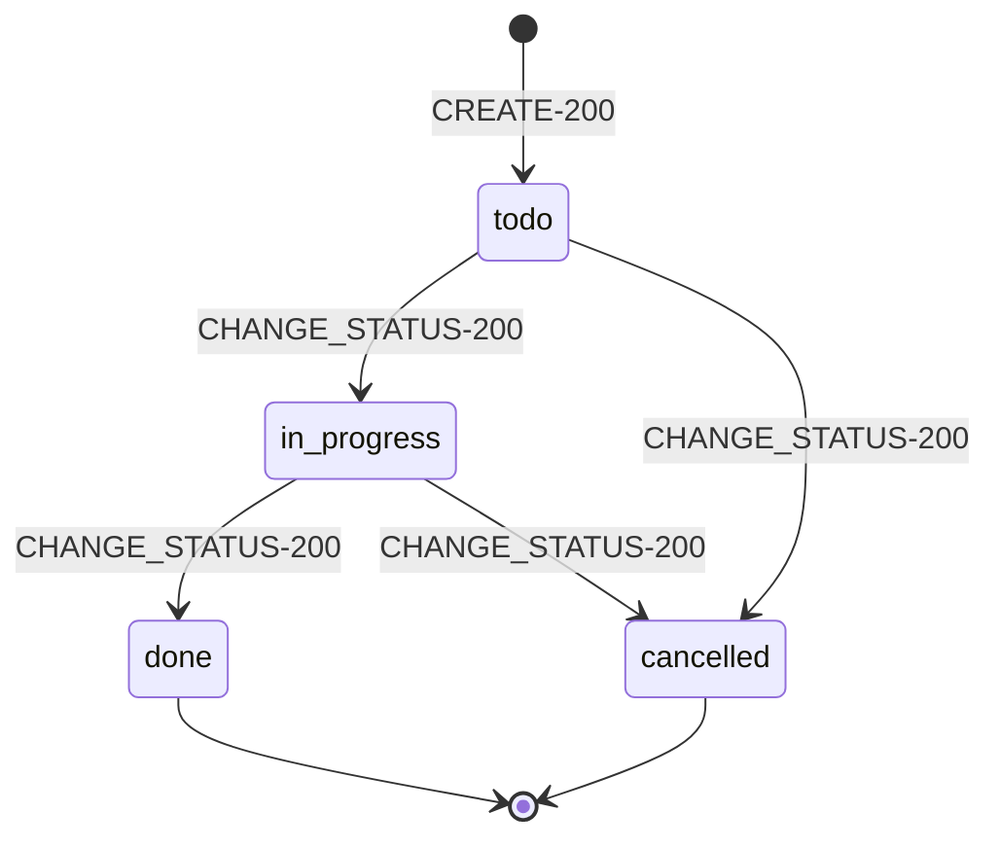

# ENT-1-TASK-IN-TASKTRACKER

RA-код: `RA-TASKS-ENTITY-TASK` → `Task`

## Что это

Корневая сущность проекта. Единица работы, видимая и управляемая как через REST, так и через MCP (одна и та же таблица, одна и та же модель `App\Models\Task`).

## Ключевые поля

| Поле | Тип | Заметки |
|---|---|---|
| `id` | uuid, PK | `HasUuids` |
| `title` | string | обязательное |
| `description` | text, nullable | |
| `status` | enum | `todo`, `in_progress`, `done`, `cancelled` — default `todo` |
| `assignee_id` | uuid, FK → users, nullable | `nullOnDelete` |
| `created_by_id` | uuid, FK → users, nullable | `nullOnDelete` |
| `created_at`, `updated_at` | timestamps | |

## Связи

- `belongsTo` `assignee` (User)
- `belongsTo` `creator` (User)

## Состояния

См. `../CLAUDE.md`-совместимую диаграмму ниже и полную таблицу переходов в `../../../tasks-naming-spec.md`.

## Инварианты

- `done` и `cancelled` — терминальные состояния; изменение статуса из них не предусмотрено UI/MCP (доменное правило, не жёсткая БД-константа).
- `assignee_id`/`created_by_id` не каскадно удаляют задачу при удалении пользователя — только обнуляются (история задачи сохраняется).
